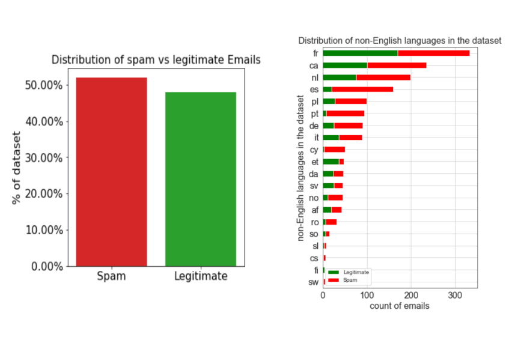
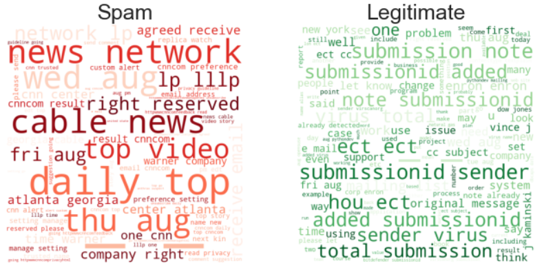
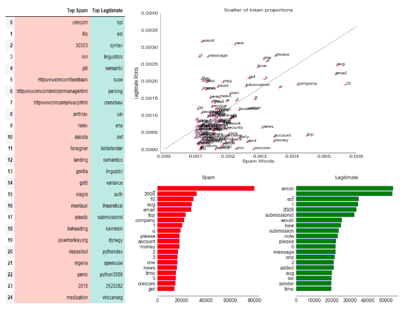
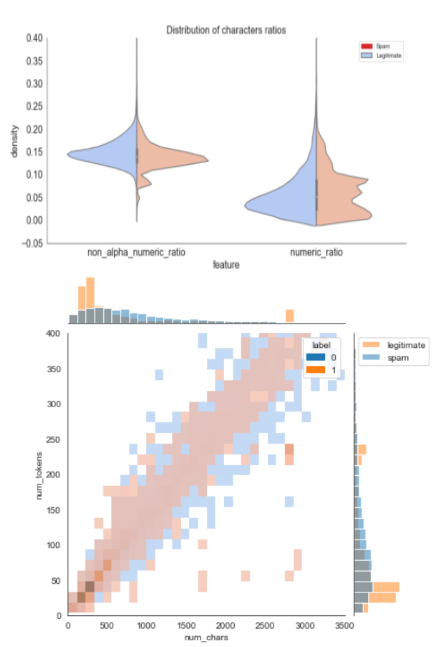

# phishing-email-eda

- This repository contains the code for the exploratory data analysis (EDA) which preformed on Kaggle's [Phishing Email Dataset](https://www.kaggle.com/datasets/naserabdullahalam/phishing-email-dataset)

- The data prepartion code for the word clouds adopted from [m3redithw](https://github.com/m3redithw/data-science-visualizations/blob/main/WordClouds/prepare.py)

- The exploration contains the following parts:

### Class Distributions

### Word Clouds

### Token Frequencies

### Text Statisitics

